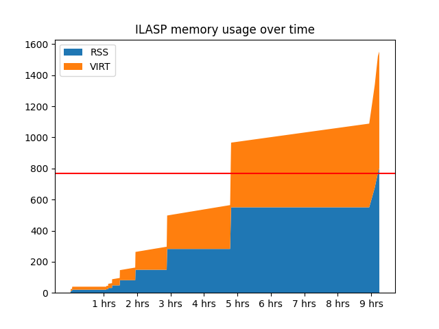

# Learning approach

Prepare by cloning the `optimization` branch of the [Symmetry_Breaking_with_ILP](https://github.com/prosysscience/Symmetry_Breaking_with_ILP/tree/optimization/) repository
and create a new environment variable with the path where it resides.

```bash
git clone --branch optimization https://github.com/prosysscience/Symmetry_Breaking_with_ILP.git
# This repository corresponds to the following paper:
# Tarzariol A., Gebser M., Schekotihin K., Law M.
# Learning to Break Symmetries for Efficient Optimization in Answer Set Programming (2023)

export Symmetry_Breaking_with_ILP="$(pwd)/Symmetry_Breaking_with_ILP"
chmod +x $Symmetry_Breaking_with_ILP/src/ILASP4.3/ILASP
```

Since SBASS fails to augment the grounding of the naive encoding of the molecule enumeration problem with sufficient SBCs,
the approach from *Tarzariol et al. (AAAI'23)*,
which relies on SBASS to produce the positive/negative examples for the formulation of a learning task for ILASP,
cannot work directly.
To evaluate the feasability of finding suitable SBCs with ILASP, we instead provide an alternative pipeline
with the means of generating the neccessary examples.

Then start to learn the symmetry breaking constraints by invoking the helper script.
This will first generate appropriate positive/negative examples and then run ILASP to search for an optimal hypothesis.

```bash
./_learn.sh min-adj BIAS # try to learn conditions to minimize the adjacency matrix lexicographically
./_learn.sh min-adj SMALL # only try to learn the pruning condition, given the auxiliary `sat/3` predicate
```

In case a solution was found within the timeout, a file `hypothesis.lp` will be created with the learned SBCs.
Additionally, the generated examples will be stored in `examples.lasp`, the ILASP input in `ILASP_input.lp` and its output in `ilasp-run.log`.

The `ILASP_input.lp` is a concatenation of the following parts:

* `ILASP_BK.lp`: an equivalent formulation of the naive encoding without aggregates and conditional predicates and thus compatible with the supported language fragment,
* `active_BK.lp`: auxiliary predicates to be used in the learned program,
* `ILASP_iterative_step_1.lp`: the hypothesis space (mode declarations),
* `examples.lasp`: the generated positive/negative examples,
* `pylasp_script_mod.py`: the ILASP version 4 PyLASP script to steere the search.

Notable information contained in the log file `ilasp-run.log` are i.a. positive/negative example count, size of the hypothesis space, the iteration count, and the total time for learning. The last line of `examples.lasp` is a comment with the duration of example generation.

Also, ILASP's memory consumption is monitored into `ilasp-mem.log` using `top` in barch mode with a 10 second interval.
You can create a diagram from this log file with `cd min-adj && python plot-ilasp-mem.py`.
The following diagram corresponds to our experiments trying to learn conditions to minimize the adjacency matrix lexicographically,
and shows that even 768GiB of RAM are insufficient for this task:



It appears that the size of the hypothesis space id the bottleneck. (We tested with various numbers of examples, but this did not have a significant impact on memory usage.)
In contrast, only learning the constraint for the lexicographic adjacency matrix symmatry-breaking (only 7426 hyotheses to consider, instead of 388,098)
completes in 7:27 minutes, using less than 2GiB of RAM.

For generating the examples, a Python3.10 script `group.py` for post-processing the models of the naive encoding is provided.
It uses NetworkX to identify isomorphism classes and
select a single representative of each class as positive example and one of the the other ones (selected by `random.uniform` with fixed seed) as negative example.
For choosing the representative, two disticnt criteria are supported: `min-adj` and `lex-leader`.
While `min-adj` takes the minimum graph representation (= graph with lexicographically minimal adjacency matrix),
`lex-leader` takes the lexicographically smallest model.
As such, the `min-adj` criterium is suitable for learning SBCs for graph representations like suggested by Codish et al. (2014).
The `lex-leader` criterium is closer to the bahaviour of SBASS, but works with a less-elegant encoding only.
Each criterium comes with its own version of `active_BK.lp` and `ILASP_iterative_step_1.lp`, as well as `lex.lp` which are the SBCs expected to be learned.

## Usage on NixOS

In case you are working on NixOS, the ILASP binary needs to be patched like so:

In case you are working on NixOS

```bash
# find libpython3.9.so.1
nix shell nixpkgs#python39
ldd $(which python)
exit
# patch the ILASP binary
nix shell nixpkgs#patchelf
patchelf \
    --set-interpreter /nix/store/1zy01hjzwvvia6h9dq5xar88v77fgh9x-glibc-2.38-44/lib/ld-linux-x86-64.so.2 \
    --set-rpath /nix/store/dq6pni9c365rsfivm6iq7wzn3aigp94l-python3-3.9.21/lib/ \
    $Symmetry_Breaking_with_ILP/src/ILASP4.3/ILASP
exit
```

You can then run `nix develop` to start a shell with the neccessary packages. Test whether ILASP works:

```bash
# (should display a help message)
$Symmetry_Breaking_with_ILP/src/ILASP4.3/ILASP
```

Then run the experiment with:

```bash
./_learn.sh min-adj BIAS >out.log 2>&1 &
disown %1
# (you can now exit the nix shell and leave the ssh session)
```
