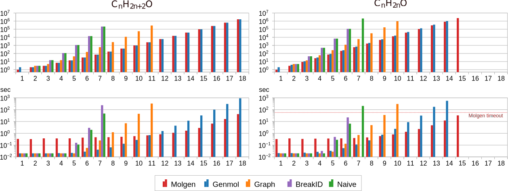

# Towards Mass Spectrum Analysis with ASP - Experimental Evaluation

<!-- markdownlint-disable MD033 -->
We evaluate our ASP implementation ("Genmol") for correctness,
avoidance of redundant solutions, and runtime.
All of our experiments were conducted on a
mid-end server (2 $\times$ QuadCore Intel Xeon 3.5GHz, 768GiB RAM, Linux NixOS 23.11)
using Clingo v5.7.1 for ASP reasoning.
Evaluation data, scripts, and results are online at
<https://github.com/knowsys/eval-2024-asp-molecules>.

## Evaluated Systems

The ASP-based core of our system Genmol consists of 174 rules
(including 44 constraints). [see <https://github.com/knowsys/eval-2024-asp-molecules/blob/main/smiles.lp>]
As a gold standard, we use the
existing commercial tool Molgen (<https://molgen.de>), which produces molecular graphs using a proprietary canonicalization approach.
Moreover, we compare our approach to three ASP-based solutions:
Naive is a direct ASP encoding [see <https://github.com/knowsys/eval-2024-asp-molecules/blob/main/naive.lp>]
of Definition 2, which serves as a baseline;
Graph refines Naive with graph-based symmetry-breaking by [[1]](#references);
and BreakID is the system by [[2]](#references),
which adds symmetry-breaking constraints automatically to
the grounding of Naive. Conceptually, BreakID is based on symmetry breaking for SAT [[3]](#references).

For Graph, we adapt Definition 12 of [[1]](#references), which applies to partitioned simple graphs $G$
that are represented by their adjacency matrix $\mathcal{A}_G$:

$\begin{align}\text{sb}(G) = \bigwedge_{e \in \mathbb{E}}\; \bigwedge_{\substack{\ell(i) = \ell(j) = e, \\i < j,\, j - i \neq 2}} \mathcal{A}_G[i] \preceq_{\{i, j\}} \mathcal{A}_G[j].\tag{1}\end{align}$

Here, $\preceq_{\{i, j\}}$ denotes the lexicographic order
comparing the $i$th and $j$th row of the adjacency matrix $\mathcal{A}_G$
of a molecular graph $G$, ignoring columns $i$ and $j$.
Graph representations that do not satisfy (1) are pruned.
These constraints can be succinctly represented in ASP,
and are appended to the naive
implementation.[see <https://github.com/knowsys/eval-2024-asp-molecules/blob/main/lex.lp>]

## Data set

For evaluation, we have extracted a dataset of molecules with
molecular formulas and graph structures using
the Wikidata SPARQL service [[4]](#references).
We selected 19,287 chemical compounds with SMILES and an article on English Wikipedia
(as a proxy for practical relevance).
Due to performance constraints, we focus on the 8,980 compound subset of up to 17 atoms.
Compounds with unconnected molecular graphs,
atoms of non-standard valence, and subgroup elements were excluded,
resulting in a dataset of 5,625 entries, of which we found 152 to have non-parsable SMILES.

## Evaluation of Correctness

Given the complexity of the implementation, we also assess its correctness empirically.
To this end, we augment our program with ASP rules that take an additional
direct encoding of a molecular graph as input, and that check if the
molecular graph found by Genmol is isomorphic to it.
This allows us to
determine if the given structures of molecules in our data set can be found
in our tool.
The validation graph structure is encoded in facts `required_bond(`$v_1$`,` $\ell(v_1)$`,` $v_2$`,` $\ell(v_2)$`,` $b(\{v_1,v_2\})$`)`
that were extracted from the SMILES representation in Wikidata.

Correctness experiments were measured with a timeout of 7 minutes.
Out of 5,473 compounds, a matching molecular structure was found for 5,338,
whereas 132 could not be processed within the timeout. For three compounds,
[_Sandalore_ (Wikidata ID Q21099635)](https://www.wikidata.org/wiki/Q21099635), and
[_Eythrohydrobupropion_ (Q113691142)](https://www.wikidata.org/wiki/Q113691142) as well as
[_Threodihydrobupropion_ (Q72518680)](https://www.wikidata.org/wiki/Q72518680),
the given structures could not be reproduced, which we traced back to errors in Wikidata that
we have subsequently corrected.

The evaluation therefore suggests that Genmol can find the correct molecular structures
across a wide range of actual compounds.
Timeouts occurred primarily for highly unsaturated, larger compounds (over 16 atoms),
where millions of solutions exist.

## Evaluation of Symmetry Breaking

To assess to what extent our approximated implementation of canonical tree representations
succeeds in avoiding redundant isomorphic solutions, we consider the smallest 1,750
distinct molecular formulas from our data set.
We then computed molecular graph representations for all 1,750 cases for each of our evaluated systems,
using Molgen as a gold standard to determine the actual number of distinct molecular graphs.
The timeout for these experiments was 60 seconds.

|  |
| :--: |
| Figure 1: _Number of models for each compound in the data set (left) and ratio of compounds with model counts within a factor of the gold standard (right)_ |

The number of returned solutions are shown in Figure 1 (left), with samples sorted
by their number of distinct graphs according to Molgen. As expected, Molgen is a lower
bound, and in particular no implementation finds fewer representations (which would be a concern for correctness),
while Naive is an upper bound. As expected, no ASP tool achieves perfect canonization of results, but the
difference between the number of solutions and the optimum vary significantly. In particular,
 BreakID rarely improves over Naive (just 24 such cases exist), though it does cause one third more timeouts.

For Naive, some samples led to over 20,000 times more models than Molgen, whereas the largest
such factor was just above $39$ for Genmol (for $C_8H_2$).
Figure 1 (right) shows the ratio of samples with model counts
within a certain factor of the gold standard. For example, the values at $10$ show the ratios of samples for
which at most ten times as many models were computed than in Molgen: this is $99\%$ for Genmol,
$72\%$ for Graph, and $48\%$ for BreakID and Naive.
All ratios refer to the same total, so the curves converge to the ratio of cases solved within
the timeout.
Their starting point marks the ratio with exact model counts:
$51\%$ for Genmol and $17\%-18\%$ for the others.

We conclude that symmetry breaking in Genmol, though not perfect, performs very well
in comparison to generic approaches. In absolute terms, the results might be close enough to the optimum
to remove remaining redundancies in a post-processing step.

## Performance and Scalability

To assess the runtime of our approach, we conduct experiments with
series of uniformly created molecular formulas of increasing size.
We consider two patterns:
formulas of the form $C_nH_{2n+2}O$ belong to tree-shaped
molecules (such as ethanol with SMILES `OCC`), whereas
formulas of the form $C_nH_{2n}O$ require one cycle
(like oxetane, `C1COC1`) or double bond (like acetone, `CC(=O)C`).
We use a timeout of 10min for all tools except Molgen, whose free version
is limited to 1min runtime. All runs are repeated five times and the median is reported.

|  |
| :--: |
| Figure 2: _Model numbers (top) and runtimes (bottom) for molecules of increasing size_ |

The results are shown in Figure 2. As before, Molgen serves as a gold standard.
As seen in the graphs on the top, the number of distinct molecular structures grows exponentially,
and this optimum is closely tracked by Genmol (perfectly for the tree-shaped case).
Graph reduces model counts too, albeit less effectively, whereas BreakID does not achieve
any improvements over Naive in these structures.

As expected, the runtimes indicate similarly exponential behavior as inputs grow, but
the point at which computation times exceed the timeout is different for each tool.
Molgen achieves the best scalability overall, whereas Genmol is most scalable
among the ASP-based approaches. BreakID is even slower than Naive, largely due to longer solving times, whereas the preprocessing of the grounding had no notable impact.

## References

1. Codish, M., Miller, A., Prosser, P., Stuckey, P.J.: Constraints for symmetry breaking
in graph representation. Constraints 24(1), 1–24 (2019). <https://doi.org/10.1007/>
s10601-018-9294-5
2. Devriendt, J., Bogaerts, B.: BreakID: Static symmetry breaking for ASP (system description).
CoRR abs/1608.08447 (2016), <http://arxiv.org/abs/1608.08447>
3. Devriendt, J., Bogaerts, B., Bruynooghe, M., Denecker, M.: _Improved static symmetry breaking
for SAT._ In: _Proc. 19th Int. Conf. Theory and Applications of Satisfiability Testing
(SAT’16). LNCS_, vol. 9710, pp. 104–122. Springer (2016). <https://doi.org/10.1007/>
978-3-319-40970-2_8
4. Malyshev, S., Krötzsch, M., González, L., Gonsior, J., Bielefeldt, A.: _Getting the most out
ofWikidata: Semantic technology usage inWikipedia’s knowledge graph._ In: _Proc. 17th Int.
Semantic Web Conf. (ISWC’18). LNCS_, vol. 11137, pp. 376–394 (2018)
